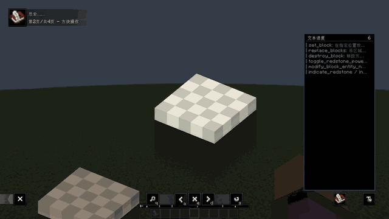
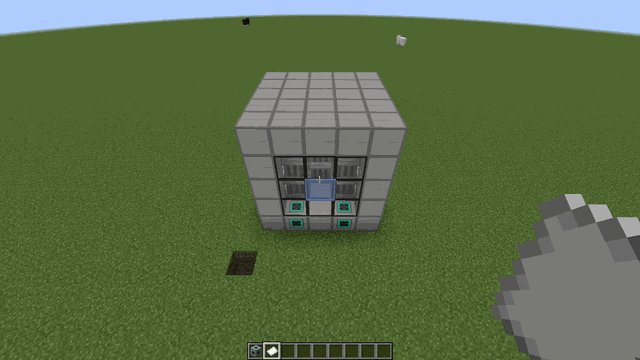
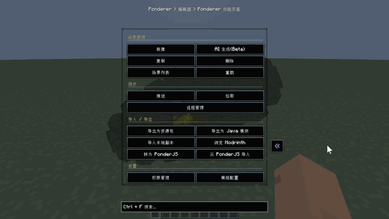
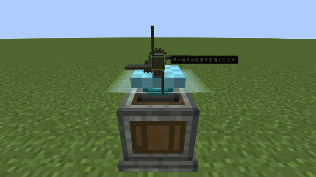
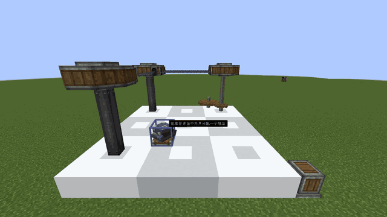
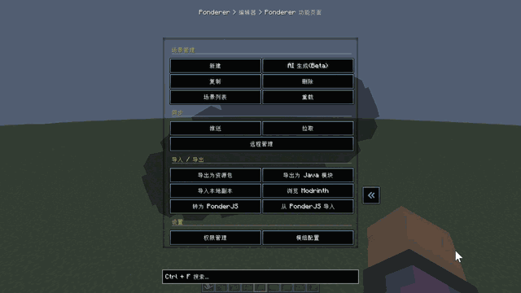

  

# Ponderer 模组介绍

Create 制作组在 6.0 版本将 Ponder 拆分为独立模组，然而较高的使用门槛使这一优秀功能未能被更多玩家所体验。Ponderer 正是为此而生。

Ponderer 是一个面向玩家与整合包作者的「游戏内思索（Ponder）制作工具」。
你不需要离开游戏，也不需要先写脚本，就可以直接在世界里搭建、录制和调整思索教学流程。

## 你可以用它做什么

### 思索的游戏内编辑

- **可视化场景编辑**：在游戏内创建、编辑、删除和排序 Ponder 思索，支持 **热重载** ，**在游戏中按 V 打开模组菜单**。
- **丰富步骤类型**：覆盖 结构展示/叠加结构、文本、实体与掉落物、镜头旋转/缩放、高亮区域、控制提示、声音、方块修改、区段移动/旋转 等绝大部分常用教程动作。
- **结构与蓝图素材**：使用蓝图工具保存选区结构，并从 `config/ponderer/structures/` 加载自定义结构素材。
- **JSON DSL 存储**：场景以 **数据驱动 JSON** 存放在 `config/ponderer/scripts/`，便于版本管理、手动调整和工具链处理。

### 导入导出与多人游戏同步

- **客户端/服务端同步**：通过 `/ponderer pull` 与 `/ponderer push` 在客户端和服务端之间同步场景，支持 **冲突处理** 与强制/保留本地策略。
- **远程工作区管理**：提供远程场景/结构浏览、拉取、删除、历史记录与回滚能力，适合服务器或整合包团队协作维护。
- **场景包导入导出**：将场景与结构打包为 **资源包格式 ZIP**，支持版本信息与自动加载，方便分发到 Modrinth / CurseForge 或整合包。
- **PonderJS 双向转换**：支持 Ponderer JSON 与 **PonderJS** 格式互相导入/导出，方便在脚本工作流和游戏内编辑之间切换。
- **权限与功能同步**：服务端可同步功能可用性，并配合权限管理控制上传、编辑和部分功能开关。

### AI 场景生成

- **多提供商支持**：可配置 **Claude / ChatGPT** 等 LLM 提供商，用自然语言生成 Ponder 场景草稿。
- **结构感知生成**：结合结构描述、注册表映射和用户提示词，让 AI 更容易引用正确方块、物品、坐标与演示步骤。
- **游戏内生成流程**：在游戏内填写需求、生成草稿并继续进入编辑器微调，避免在外部文件和游戏之间反复切换。

### 思索投影仪

- **两种投影仪方块**：提供 **微缩投影仪** 与 **实景投影仪** ，将源物品对应的 Ponder 场景投射到世界中。
- **播放与触发控制**：支持非常丰富的可配置项，满足各场景需求。
- **多人服务器管理**：服务端可同步并管控投影仪功能开关，关闭后投影仪不再可放置、配置或播放，适合纯原版服务器。

### 思索内体验优化

- **文本进度条**：在思索显示文本进度板，解决思索不能手动拖动进度条的拖沓问题。
- **界面思索**：支持展示界面、修改槽位和模拟点击流程，用于演示容器、菜单、物品栏或自定义 UI 的交互逻辑。
- **内置引导与配置**：包含内置示例场景、快捷键设置、界面缩放与模组配置页，便于上手和按需调整体验。

## 适合哪些人

- 想给自己整合包做引导教程的作者
- 想给服务器玩家制作上手教学的管理员
- 想用更直观方式维护、体验 Ponder 内容的普通玩家

## 核心体验

Ponderer 的目标是：
**把"写教程"变成"在游戏里直接搭教程"**。

从创建、编辑、预览到同步，整个流程尽量保持在 Minecraft 内完成，让思索内容的制作更快、更直观。

## 画廊

  

    

      

        
        
丰富的内置步骤

      

      

        
        
使用蓝图保存结构并在思索中使用

      

      

        
        
AI驱动的思索自动生成

      

    

    

      

        
        
微缩思索投影仪

      

      

        
        
实景思索投影仪

      

      

        
        
服务器多端同步与远程管理

      

    

  

## Q&A

### 1. 版本支持计划？

| 游戏版本         | Forge                     | NeoForge                  | Fabric              |
| ---------------- | ------------------------- | ------------------------- | --------------------------- |
| **26.1**   | **无支持计划**      | **即将支持**        | **即将支持**          |
| **1.21.1** | **无支持计划**      | **维护中**          | **维护中**        |
| **1.20.1** | **维护中**          | **无支持计划**      | **维护中** |
| **1.12.2** | **计划支持**          | **无计划支持**      | **无计划支持** |
| **1.7.10** | **计划支持**          | **无计划支持**      | **无计划支持** |

### 2. 为什么不直接使用 PonderJS？

本模组提供思索多端同步能力，直接传输 JS 脚本会引入额外的安全隐患。Ponderer 采用更安全的数据传输方式，并提供与 PonderJS 的双向转换能力。你可以在两种工作流之间按需切换。同时， Ponderer 提供了大量PonderJS 原生暂不支持的接口。

---

# Ponderer Mod Introduction

In Create 6.0, the Create team split Ponder into a standalone mod. However, the high barrier to using it has kept this excellent feature from reaching more players. Ponderer was created for this very reason.

Ponderer is an "in-game Ponder authoring tool" for players and modpack authors.
You do not need to leave the game or write scripts first. You can build, record, and adjust Ponder tutorial flows directly in the world.

## What You Can Do With It

### In-Game Ponder Editing

- **Visual scene editing**: Create, edit, delete, and reorder Ponder scenes in-game, with **hot reload** support. **Press V in-game to open the mod menu**.
- **Rich step types**: Covers most common tutorial actions, including structure display/overlay structures, text, entities and dropped items, camera rotation/zoom, highlighted areas, control hints, sounds, block edits, and section movement/rotation.
- **Structures and blueprint assets**: Save selected areas with the blueprint tool and load custom structure assets from `config/ponderer/structures/`.
- **JSON DSL storage**: Scenes are stored as **data-driven JSON** under `config/ponderer/scripts/`, making them easy to version, adjust manually, and process with toolchains.

### Import/Export and Multiplayer Sync

- **Client/server sync**: Use `/ponderer pull` and `/ponderer push` to sync scenes between client and server, with **conflict handling** and force/keep-local strategies.
- **Remote workspace management**: Browse, pull, delete, inspect history, and roll back remote scenes or structures, making it suitable for server and modpack teams to maintain content together.
- **Scene pack import/export**: Bundle scenes and structures into **resource-pack-format ZIP files** with version information and auto-loading, making distribution to Modrinth, CurseForge, or modpacks easier.
- **Bidirectional PonderJS conversion**: Import and export between Ponderer JSON and **PonderJS** formats, so you can switch between script workflows and in-game editing.
- **Permissions and feature sync**: Servers can synchronize feature availability and use permission management to control uploads, editing, and selected feature toggles.

### AI Scene Generation

- **Multi-provider support**: Configure LLM providers such as **Claude / ChatGPT** and generate draft Ponder scenes from natural-language prompts.
- **Structure-aware generation**: Combines structure descriptions, registry mappings, and user prompts so AI can more easily reference the correct blocks, items, coordinates, and demonstration steps.
- **In-game generation flow**: Fill in your request in-game, generate a draft, and continue refining it in the editor without repeatedly switching between external files and Minecraft.

### Ponder Projectors

- **Two projector blocks**: Provides a **Miniature Projector** and a **Life-Size Projector**, projecting the Ponder scene associated with a source item into the world.
- **Playback and trigger controls**: Supports a rich set of configurable options for different scene needs.
- **Multiplayer server management**: Servers can synchronize and control projector feature toggles. When disabled, projectors can no longer be placed, configured, or played, making this suitable for servers that want a more vanilla-focused experience.

### In-Ponder Experience Improvements

- **Text progress bar**: Shows a text progress panel inside Ponders, easing the slow pacing caused by not being able to drag the progress bar manually.
- **UI Ponders**: Supports showing interfaces, modifying slots, and simulating click flows to demonstrate containers, menus, inventories, or custom UI interactions.
- **Built-in guidance and configuration**: Includes built-in example scenes, keybinding settings, UI scaling, and mod configuration pages for easier onboarding and tuning.

## Who This Is For

- Modpack authors who want in-game onboarding tutorials
- Server admins who want player-friendly guidance content
- Regular players who want a more visual way to maintain and experience Ponder content

## Core Experience

Ponderer's goal is:
**Turn "writing tutorials" into "building tutorials directly in-game."**

From creation, editing, and previewing to synchronization, the whole workflow stays inside Minecraft as much as possible, making Ponder content faster and more intuitive to create.

## Gallery

  

    

      

        
        
Rich built-in steps

      

      

        
        
Save structures with blueprints and reuse them in Ponder

      

      

        
        
AI-driven automatic Ponder generation

      

    

    

      

        
        
Miniature Ponder Projector

      

      

        
        
Life-Size Ponder Projector

      

      

        
        
Multi-client sync and remote management

      

    

  

## Q&A

### 1. What is the version support plan?

| Game Version | Forge                  | NeoForge               | Fabric                 |
| ------------ | ---------------------- | ---------------------- | ---------------------- |
| **26.1**     | **No support planned** | **Coming soon**        | **Coming soon**        |
| **1.21.1**   | **No support planned** | **Maintained**         | **Maintained**         |
| **1.20.1**   | **Maintained**         | **No support planned** | **Maintained**         |
| **1.12.2**   | **Planned**            | **No support planned** | **No support planned** |
| **1.7.10**   | **Planned**            | **No support planned** | **No support planned** |

### 2. Why not use PonderJS directly?

This mod provides client/server synchronization for Ponder content, and directly transmitting JS scripts would introduce additional security risks.

Ponderer uses a safer data-transfer approach and provides bidirectional conversion with PonderJS, so you can switch between workflows as needed. At the same time, Ponderer provides many APIs that PonderJS does not natively support yet.
